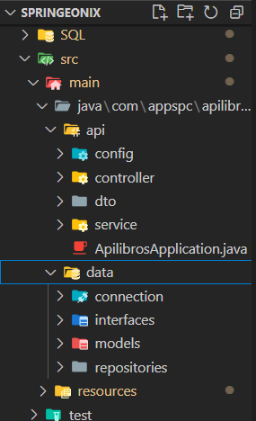
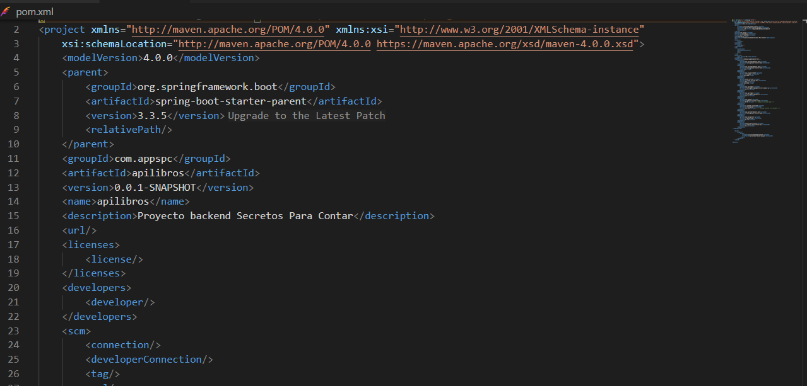
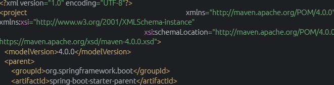
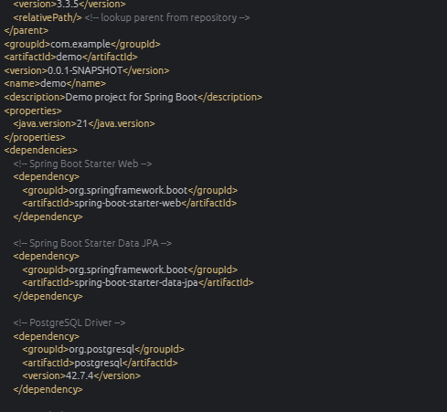
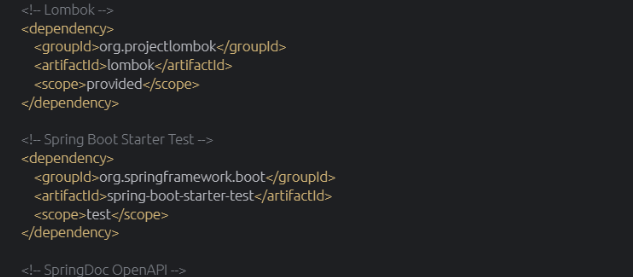
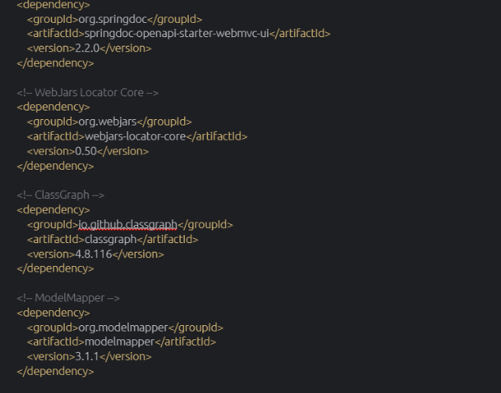
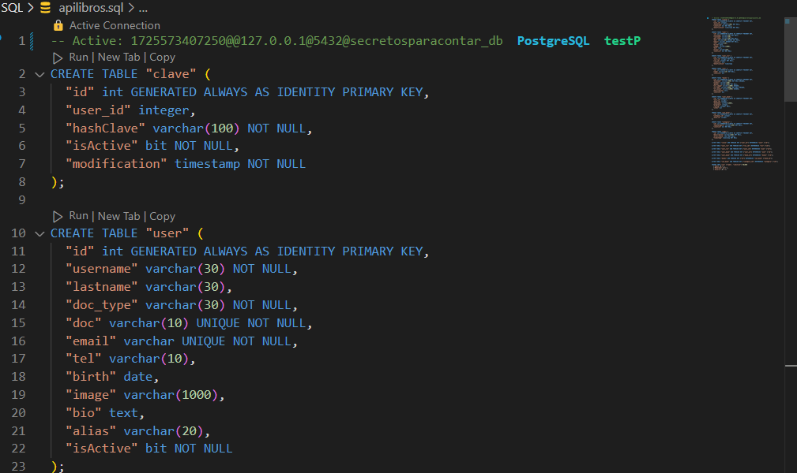
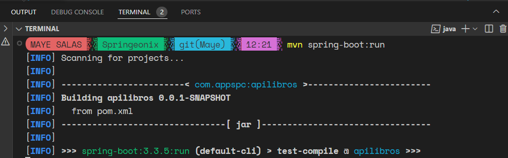
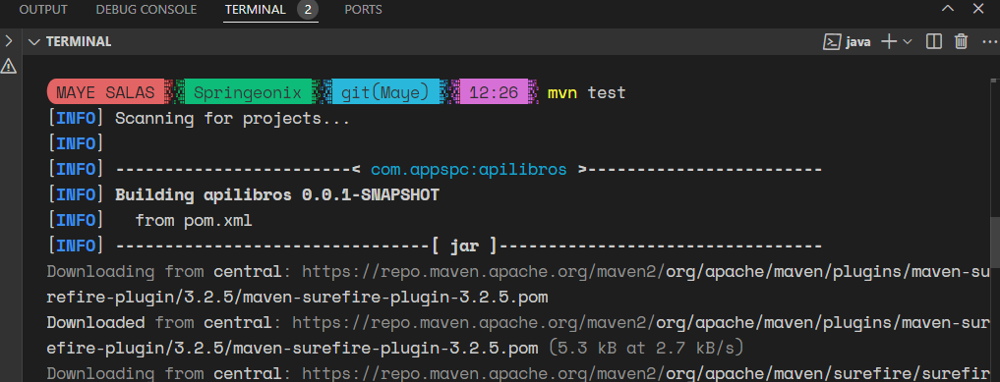

# MANUAL DE ENTREGA PROYECTO BACKEND

## 1. Introducción 🔒
Este manual describe la entrega del proyecto Backend elaborado en el lenguaje de programación Java. El proyecto utiliza PostgreSQL como base de datos, Swagger para visualizar la información de nuestra API y sigue una estructura de capas para organizar el código.

## 1.1 ¿Qué herramientas necesitas para utilizar este proyecto? 🧐
       • JDK 21 (Java Development Kit)
       • Maven 
       • Base de datos PostgreSQL 
       • PgAdmin 4 

## 1.2 Estructura del proyecto 🏢

- **src/main/java/**: Contiene el código Java de la aplicación.
- **com.appspc.apilibros**: Paquete principal de la aplicación.
- **controllers**: Clases que manejan las solicitudes HTTP y devuelven respuestas.
- **dto**: Clases que representan los datos transferidos entre la aplicación y la base de datos.
- **services**: Clases que proporcionan la lógica de negocio de la aplicación.
- **interfaces**: Interfaces que definen las operaciones que se pueden realizar en la aplicación.
- **models**: Clases que representan los datos almacenados en la base de datos.
- **repositories**: Clases que proporcionan acceso a la base de datos.
- **src/main/resources**: Contiene los archivos de configuración y recursos de la aplicación.
- **application.properties**: Archivo de configuración que define las propiedades de la aplicación, incluyendo la conexión con la base de datos.
- **apilibros.sql**: Archivo SQL que define la creación de las tablas de la base de datos.
- **src/test/java**: Contiene las pruebas unitarias y de integración de la aplicación.
- **ApilibrosApplicationTests.java**: Clase que contiene las pruebas unitarias y de integración de la aplicación.

## 2. Configuración del proyecto ⚙️
A través de un archivo pom.xml se realiza la configuración de Maven paara el proyecto Spring Boot. Este contiene toda la información necesaria para construir, empaquetar y gestionar las dependencias del proyecto 


## 2.1 Detalles del proyecto 📍
∘ Parent: Utiliza spring-boot-starter-parent como dependencia principal , que incluye versiones predefinidas de plugins y dependencias 
∘ GroupId, ArtifactId y Version: Identificadores únicos del proyecto.
∘ Java Version: Especifica la versión de Java utilizada (en este caso, Java 21).

## 2.2 Dependencias principales 🔗
**Spring Boot Starter Web**: Incluye las dependencias necesarias para desarrollar aplicaciones web.
**Spring Boot Starter Data JPA**: Incluye JPA y otras dependencias para manejar la persistencia de datos.
**PostgreSQL Driver**: Controlador JDBC para conectarse a una base de datos PostgreSQL.
**Lombok**: Herramienta que reduce la cantidad de código necesario al generar automáticamente getters, setters, y otros métodos comunes.
**Spring Boot Starter Test**: Incluye dependencias para pruebas unitarias y de integración.
**SpringDoc OpenAPI**: Proporciona integración con OpenAPI para documentar APIs RESTful.
**WebJars Locator Core**: Gestiona dependencias web (JavaScript, CSS) en formato JAR.
**ClassGraph**: Herramienta para escaneo de clases en el classpath.
**ModelMapper**: Herramienta para el mapeo de objetos, facilitando la conversión entre DTOs y entidades.
**Jakarta Persistence API**: Define la API de persistencia para JPA.

## 2.3 Plugins de Build
**Spring Boot Maven Plugin**: Permite empaquetar la aplicación Spring Boot en un archivo JAR ejecutable y configura exclusiones, como Lombok, para el proceso de construcción.

**pom.xml**






## 3. Configuración de la base de datos ⚙️
La base de datos se configura en el archivo application.properties de la siguiente manera:
```bash
spring.application.name=secretosparacontar_db
spring.mvc.pathmatch.matching-strategy=ANT_PATH_MATCHER
server.port=8080
server.error.path=/error
spring.datasource.password="contraseña de postgreSQL"
spring.datasource.username=postgres
spring.datasource.driverClassName=org.postgresql.Driver
spring.datasource.url=jdbc:postgresql://localhost:5432/secretosparacontar_db
spring.jpa.hibernate.ddl-auto=update
spring.jpa.properties.hibernate.jdbc.lob.non_contextual_creation=true
```

## 4. Creación de las Tablas de la Base de Datos 📋
Las tablas de la base de datos se crean utilizando el archivo apilibros.sql que se encuentra en el directorio **src/main/resources**


## 5. Ejecución de la Aplicación
La aplicación se ejecuta utilizando el comando ```bash mvn spring-boot:run``` en la terminal.


## 6. Visualización de la API
La API se puede visualizar utilizando Swagger en la URL **http://localhost:8080/swagger-ui.html**

## 7. Pruebas Unitarias y de Integración
Las pruebas unitarias y de integración se encuentran en la clase ApilibrosApplicationTests.java que se encuentra en el directorio src/test/java. Estas pruebas se pueden ejecutar utilizando el comando ```bash mvn test``` en la terminal.


# BACKEND PROJECT DELIVERY MANUAL 

## 1. Introduction
This manual describes the delivery of the Backend project developed in Java programming language. The project uses PostgreSQL as the database, Swagger for API documentation, and follows a layered structure to organize the code.

## 1.1 What tools do you need to use this project?
• JDK 21 (Java Development Kit)
• Maven
• Base de datos PostgreSQL
• pgAdmin 4

## 1.2 Project Structure

- **src/main/java**: Contains the Java code for the application.
- **com.example.apilibros**: Main package for the application.
- **controllers**: Classes that handle HTTP requests and return responses.
- **dto**: Classes that represent the data transferred between the application and the database.
- **services**: Classes that provide the business logic for the application.
- **interfaces**: Interfaces that define the operations that can be performed on the application.
- **models**: Classes that represent the data stored in the database.
- **repositories**: Classes that provide access to the database.
- **src/main/resources**: Contains the configuration files and resources for the application.
- **application.properties**: Configuration file that defines the application properties, including the database connection.
- **apilibros.sql**: SQL file that defines the creation of the database tables.
- **src/test/java**: Contains the unit tests and integration tests for the application.
- **ApilibrosApplicationTests.java**: Class that contains the unit tests and integration tests for the application.

## 2.  Project Configuration: 
The project is configured using a pom.xml file to manage Maven for the Spring Boot project. This file contains all the necessary information to build, package, and manage the project’s dependencies.


## 2.1 Project Details:
∘ Parent: Uses spring-boot-starter-parent as the main dependency, which includes predefined versions of plugins and dependencies.
∘ GroupId, ArtifactId, and Version: Unique identifiers for the project.
∘ Java Version: Specifies the Java version used (in this case, Java 21).

## 2.2 Main Dependencies:
- Spring Boot Starter Web: Includes the necessary dependencies to develop web applications.
- Spring Boot Starter Data JPA: Includes JPA and other dependencies to handle data persistence.
- PostgreSQL Driver: JDBC driver for connecting to a PostgreSQL database.
- Lombok: A tool that reduces boilerplate code by automatically generating getters, setters, and other common methods.
- Spring Boot Starter Test: Includes dependencies for unit and integration testing.
- SpringDoc OpenAPI: Provides OpenAPI integration for documenting RESTful APIs.
- WebJars Locator Core: Manages web dependencies (JavaScript, CSS) in JAR format.
- ClassGraph: A tool for scanning classes in the classpath.
- ModelMapper: A tool for object mapping, simplifying conversions between DTOs and entities.
- Jakarta Persistence API: Defines the persistence API for JPA.

## 2.3 Build Plugins:
**Spring Boot Maven Plugin**: Enables packaging the Spring Boot application into an executable JAR file and configures exclusions, such as Lombok, during the build process.

**pom.xml**


## 3. Database Configuration
The database is configured in the application.properties file as follows:
```bash
spring.application.name=secretosparacontar_db
spring.mvc.pathmatch.matching-strategy=ANT_PATH_MATCHER
server.port=8080
server.error.path=/error
spring.datasource.password="contraseña de postgreSQL"
spring.datasource.username=postgres
spring.datasource.driverClassName=org.postgresql.Driver
spring.datasource.url=jdbc:postgresql://localhost:5432/secretosparacontar_db
spring.jpa.hibernate.ddl-auto=update
spring.jpa.properties.hibernate.jdbc.lob.non_contextual_creation=true
```
## 4. Creating the Database Tables
The database tables are created using the apilibros.sql file located in the src/main/resources directory.


## 5. Running the Application
The application is run using the command mvn spring-boot:run in the terminal.


## 6. API Documentation
The API is documented using Swagger and can be accessed at **http://localhost:8080/swagger-ui.html**

## 7. Unit Tests and Integration Tests
The unit tests and integration tests are located in the ApilibrosApplicationTests.java class in the src/test/java directory. These tests can be run using the command mvn test in the terminal.


